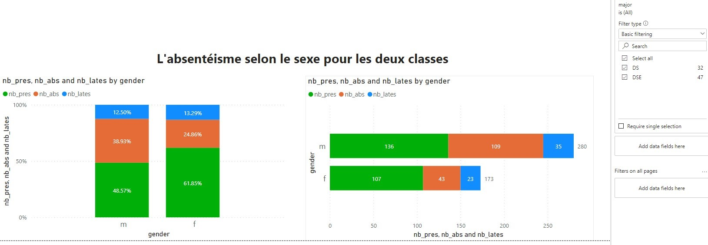

# Data Warehousing Project :

- Description : Implementation of a Business Intelligence solution for the case study "Absence at INSEA". 
- Tasks : 
1. Desingning KPIs, DWH schema and the ETL pipeline. 
2. implementation and automation of the ETL process. 
3. Business Reporting. 
- Tools : Jupyter NB, Python, Airflow, Power BI, PostgreSQL

# Data Warehouse Schema :

# ETL pipeline (Airflow DAG) :

# Power BI Dashborads :
- Overall Stats

- Filter by sexe
